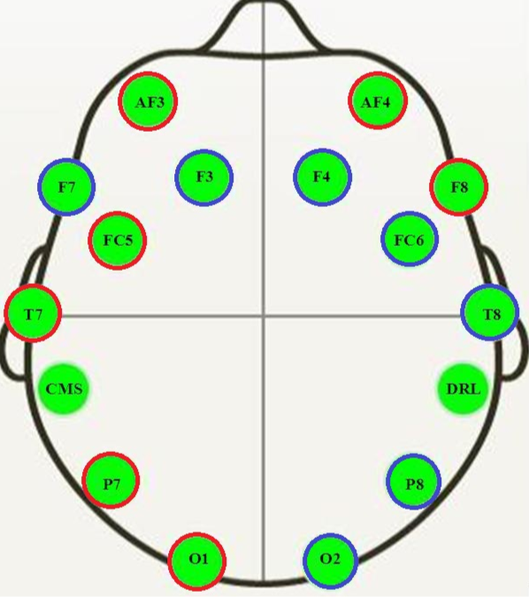

```{r setup, include=FALSE}
knitr::opts_chunk$set(echo = TRUE)

# Let's load needed libraries
library(tidyverse)
library(caret)

# Let's load cooked values
dataFile <- file.path(getwd(),"rda","eyePredictor.rda")
load(dataFile)

```

# Introduction
## Motivation
Arguably, the most rewarding jobs are those that benefit the community. We've been browsing different datasets publicly available as suggested in the course and finally we've decided to work in a healthcare/biomedical topic, hoping that eventually that can revert on human welfare.

Therefore, we show here an approach for the detection of open eyes via electroencephalography (EEG). This is useful for human cognitive state classification finding applications with:

* Driving drowsiness detection
* Infant sleep-waking state identification
* Epileptic seizure detection
* Stress features identification

## Goals
We would like to develop the most reliable predictive system.

For this purpose, we will explore the data publicly available with a fresh eye since many other works have already been done.

Instead of using the value of each EEG cell, we will analyse the time component piece of information that has not been used so far, and prepare a new dataset for our system, *we will use FFT( Fast Fourier Transformation) to extract time domain information.*

This means that we will invest a good piece of time exploring and understanding the raw dataset.

After this, we will train our predictor with different models and prepare an ensemble.

Last not least, this project is meant as capstone for the HarvardX-PH125.9x course.


# Data analysis
## Experiment setup
The dataframe comprises measurements of 14 EEG cells along 117s. This means that the data is stored sequentially and *has temporal information*.

Simultaneously, there was a camera recording the state of the eye of the specimen.

Finally, the state of the eye was manually added to the dataframe.



As far as we understand, there was only 1 specimen (person) tested.

For more information, see reference 1.

## Repository

We would like to thank [UCI](https://archive.ics.uci.edu/ml/index.php) for sorting and sharing with the community all the data.

More expecifically for our case, information and files can be found [here](https://archive.ics.uci.edu/ml/datasets/EEG+Eye+State).

## Exploring data
The imported data has all values defined (there're no "na" fields).

The dataframe as 15 columns (fields):

* 14 of them labeled as the EEG cell measured e.g. AF3, F7, F3 , etc... They contain a positive numeric value.
* 1 named _eyeDetection_ , which holds the state of the eye as follows
    * Close = 0
    * Open = 1


### Cleaning the data
It is interesting to see that in many variables, there're many outsiders (values way out of the trend).

This can easily be detected checking the quartils and the range for each variable via a summary command. Alternatively, boxplots are also useful.

```{r, echo=FALSE}
# Load rawData
rawFile <- file.path(getwd(),"rda","rawData.rda")
load(rawFile)
rm(rawFile)

# Boxplot of variables
rawData %>% select(-eyeDetection) %>%
        pivot_longer(., cols=everything(), names_to="Var", values_to="Val") %>%
        ggplot(aes(x=Var, y=Val)) +
        geom_boxplot() +
        scale_y_log10() +
        ggtitle("Boxplot of variables") +
        ylab("Values (log10)")

```

**This suggests that there're some artifacts in the measurements that must be cleaned.**

Let's identify those points by the average.

Using a a boxplot of only the means we can visually detect that most of the points are below 10000.

We can refine the search and detect that also the means must be above 4200.


```{r, echo=FALSE, fig.asp=0.5}
# Boxplot with no filter
rawData %>% mutate(avg=apply(.[1:14],1,mean),stdev= apply(.[1:14],1,sd)) %>%
          select(eyeDetection, avg,stdev) %>%
          ggplot(aes(x=0,y=avg)) +
          geom_boxplot() + 
          scale_y_log10() + 
          geom_jitter(color="red",alpha=0.5) +
          ggtitle("Boxplot of means per observation (no filter)")
```

```{r, echo=FALSE, fig.asp=0.5}
# Boxplot filtering <10000 & >4200
# We will consider this population clean
rawData %>% mutate(avg=apply(.[1:14],1,mean),stdev= apply(.[1:14],1,sd)) %>%
          filter(avg<10000 & avg > 4200) %>%
          select(eyeDetection, avg,stdev) %>%
          ggplot(aes(x=0,y=avg)) +
          geom_boxplot() + 
          scale_y_log10() + 
          geom_jitter(color="red",alpha=0.5) +
          ggtitle("Boxplot of means per observation (filter avg between 4200 & 10000)")

```

We will consider the result of this filtering as clean data. Therefore:

```{r, echo= FALSE}
eyeData <- rawData %>% mutate(avg=apply(.[1:14],1,mean),stdev= apply(.[1:14],1,sd)) %>%
          filter(avg<10000 & avg > 4200)

# Number of observations considered as "dirty"
sprintf("Number of corrupted rows removed: %i",nrow(rawData)-nrow(eyeData))

```

We can now continue exploring the data.

### Raw data (non-treated) per EEG cell

Let's start comparing back to back the values for each EEG cell:

```{r, echo=FALSE}
eyeData %>%
        select(-avg, -stdev) %>%
        pivot_longer(!eyeDetection, names_to="Var", values_to="Val") %>%
        ggplot(aes(x=Var, y=Val, fill=eyeDetection)) +
        geom_boxplot() +
        ggtitle("Boxplot of each EEG cell") +
        ylab("Values")

```

For the sake of a better understanding, we will center each cell around its mean.


```{r, echo=FALSE}
eyeData %>%
        select(-avg, -stdev) %>%
        mutate(across(1:14, ~ .-mean(.))) %>%
        pivot_longer(!eyeDetection, names_to="Var", values_to="Val") %>%
        ggplot(aes(x=Var, y=Val, fill=eyeDetection)) +
        geom_boxplot() +
        ggtitle("Boxplot of each EEG cell (centered)") +
        ylab("Values (centered around mean)")

```

After visual checking populations overlap or, in other words, *we can conclude that there's no clear reading at each cell that predicts the opening of the eyes*

### Mean vs sd

Last attempt, we will transform the reading of all cells to its mean and std deviation and plot it as follows:

```{r, echo=FALSE}
eyeData %>% select(eyeDetection, avg, stdev) %>%
        ggplot(aes(x=avg, y=stdev, color=eyeDetection, alpha= 0.5)) +
        geom_point() +
        ggtitle("Mean vs Sd")

```

It is worth noting that some patterns arise. Hence, mean and standard dev could be used as predictors.

*However, it is not the purpose of this paper to exploit it as we will focus on time series.*

## Taking leverage of time series
Let's transform the data knowing that it is stored time sequentially.

Goal is to find any link between opening and time i.e. is there any hint what the state is/will be in the series?

First thing we have to do is to identify the different chunks of time series, where the eye is fully close or open.

```{r, echo=FALSE}
# Numerate chunks in time (consecutive rows) where eye is resting open/close
# We're cheating here because first value na is known to be "0"
eyeData <- eyeData %>%                 mutate(test=(eyeDetection!=lag(eyeDetection,default="0")), chunk=cumsum(test)) %>%
          select(-test)

```


We have detected 24 chunks along the 117s of the raw data.

After this we will do per each chunk and per each EEG the fast fourier transformation (FFT) where the following data is extracted:

* Mean value i.e. amplitude at $f_0=0$
* Three most significant frequencies $f_1, f_2, f_3$

### Visualising the results
As a first approach, let's plot the amplitude vs frequency of the top 3 harmonics for each cell:

```{r, echo=FALSE}
# We know the total span of data is 117s; therefore the discrete step
h <- 117/nrow(rawData)

# Let's load functions
source("Eye_State_Predictor_Functions.R")

# Plotting the top 3 harmonics of each chunk, no discriminatio by EEG cell
eyeData %>% group_by(chunk) %>%
  summarise(eyeDetection = eyeDetection,
            across(1:14, ~ fft_top3(.,1/h)[2,1], .names="{.col}_f_1"),
            across(1:14, ~ fft_top3(.,1/h)[2,2], .names="{.col}_a_1"),
            across(1:14, ~ fft_top3(.,1/h)[3,1], .names="{.col}_f_2"),
            across(1:14, ~ fft_top3(.,1/h)[3,2], .names="{.col}_a_2"),
            across(1:14, ~ fft_top3(.,1/h)[4,1], .names="{.col}_f_3"),
            across(1:14, ~ fft_top3(.,1/h)[4,2], .names="{.col}_a_3")
  ) %>%
pivot_longer(cols=-c(eyeDetection,chunk),
             names_to=c("EEG","feat","harmonic"),
             names_sep = "_",
             values_to = "val") %>%
  unique() %>%
pivot_wider(names_from = "feat",
            values_from = "val") %>%
  ggplot(aes(x=f, y=a, colour=eyeDetection, alpha=0.5)) +
  geom_point() +
        scale_y_log10() +
        scale_x_log10() +
        xlab("freq (Hz) (log)") +
        ylab("Amplitude (log)") + 
        ggtitle("Top 3 significant harmonics; no EEG discrimination")

```

It is really interesting to notice that there seems to be a discrimination by frequencies; in other words, *when the eyes are open, there seems to be significant brainwaves higher than 5Hz.*

Unfortunately, we cannot tell the origin of these frequencies but they sure are interesting for predicting states.

Another result yielding from this graph is the amplitude; it doesn't provide useful information as it is spreaded over the two states. Therefore, *amplitude of each harmonic won't be used as a predictor* of the system.

Last not least, let's plot each harmonic per each EEG cell to check if there's any clear predictor i.e. two different populations that do not overlap.

Unfortunately, this is not the case.

\newpage
\blandscape
```{r, echo=FALSE, fig.width=9, fig.asp=0.62}
# Plotting the top 3 harmonics of each chunk, with discrimination by EEG cell
eyeData %>% group_by(chunk) %>%
  summarise(eyeDetection = eyeDetection,
            across(1:14, ~ fft_top3(.,1/h)[2,1], .names="{.col}_f_1"),
            across(1:14, ~ fft_top3(.,1/h)[2,2], .names="{.col}_a_1"),
            across(1:14, ~ fft_top3(.,1/h)[3,1], .names="{.col}_f_2"),
            across(1:14, ~ fft_top3(.,1/h)[3,2], .names="{.col}_a_2"),
            across(1:14, ~ fft_top3(.,1/h)[4,1], .names="{.col}_f_3"),
            across(1:14, ~ fft_top3(.,1/h)[4,2], .names="{.col}_a_3")
  ) %>%
pivot_longer(cols=-c(eyeDetection,chunk),
             names_to=c("EEG","feat","harmonic"),
             names_sep = "_",
             values_to = "val") %>%
  unique() %>%
pivot_wider(names_from = "feat",
            values_from = "val") %>%
  ggplot(aes(x=f, y=a, colour=eyeDetection, alpha=0.5)) +
  geom_point() +
  facet_wrap(~ EEG + harmonic,dir="h") +
        scale_y_log10() +
        scale_x_log10() +
        xlab("freq (Hz) (log)") +
        ylab("Amplitude (log)") + 
        ggtitle("Top 3 significant harmonics")
```

\elandscape

## Preparing the new dataset
Under the light of the above investigation, it seems useful to transform the original time based data into a frequency domain basis.

This yields to consider 4 parameters per each EEG cell i.e. average, and frequencies for the top 3 harmonics.

In practice the new dataset will have 57 significant columns.

### The curse of FFT
We will soon notice that the fourier transform comes with the shortening of the observations since only full chunks of time are analysed.

This means that only 24 observations are taken out of 15k points (117s).

This will prevent constructing a robust predictor since we need data, the more the better.

### A more simplified dataset
Because the number of observations is too little, we need to constraint the number of predictors too; otherwise the system will be overtrained.

Therefore, we will construct a new simplified dataset with the mean value and mean top 3 frequencies of all the EEG readings.

This will yield to a dataframe as:

Column | Explanation 
------ | -----------
eyeDetection | Wether the eye was close (0) or open(1) during that time series
avg | Mean value of all EEG cells during that time
freq | Mean value of the sum of the top 3 frequencies across all EEG cells during that time


Graph below shows the simplified FFT system.
```{r, echo=FALSE}
# Because we have a very small dataset (only 24 time series)
# Let's simplify the same data
eyeDataFFTsimple <- eyeData %>% group_by(chunk) %>%
  summarise(eyeDetection = first(eyeDetection),
            across(1:14, ~ fft_top3(.,1/h)[1,2], .names="{.col}_avg"),
            across(1:14, ~ sum(fft_top3(.,1/h)[2:4,1]), .names="{.col}_freq")
  ) %>%
  pivot_longer(!c(eyeDetection,chunk), names_to=c("EEG","feature"), names_sep="_", values_to="Val") %>%
  unique() %>%
  group_by(chunk,feature,eyeDetection) %>%
  summarise(mean=mean(Val)) %>%
  pivot_wider(names_from="feature", values_from="mean") %>%
  ungroup()

# Visualisation of the simplified time series
eyeDataFFTsimple %>%
  ggplot(aes(x=freq,y=avg, color=eyeDetection)) +
  geom_point()+
  xlab("freq(Hz)") +
  ggtitle("Discrimination by mean and sum of top 3 frequencies per time series")

```


## Modelling
The shortage of data restraints a lot the type of models worth trying.

We will use only the most simple:

* Linear regresion
* K neighbours
* QDA generative model
* Ensemble of the above

Literature for each model can be found in ref. 2.

### Train and test sets
We will stick to the rule of using just 10% of the data for testing purposes.

**This means in practice only 4 observations for testing and 20 for training!**

Not at all what we're used to work with using machine learning.

Also for the training, we will use a cross-validation of 10 foldings, keeping 10% for validation.

# Results
Hereafter the results for each model and the ensemble:

```{r, echo=FALSE}
knitr::kable(accuracy_results)
```

# Conclusion
We have noted in this work that there seems to be a frequency relationship linked to the opening of the eyes.

However and due to the scarce data available, we can only scratch the surface and use very simplified predictors.

The overall accuracy tested on 4 cases agree on 75%.

Due to the lack of data, we cannot claim to outperform the 98% accuracy claimed by the original paper (see ref. 1)

## Future work

Unfortunately, the data we have is scarce; in order to dive into it and reach a satisfactory conclusion, more specimens in more circumstances are needed.

If the originally proposed system of 56 predictors is to be used, we would need at least 10 times more observations, around 600, to start a proper investigation.

Nonetheless, we are confident that this novel approach i.e. the usage of fourier components per each time series, will be of benefit in further works.

# References

1. Oliver Rösler, David Suendermann."A First Step towards Eye State Prediction Using EEG". http://www.oeft.com/su/pdf/aihls2013.pdf
2. Rafael A. Irizarry, "Introduction to Data Science Data Analysis and Prediction Algorithms with R", 2019.
